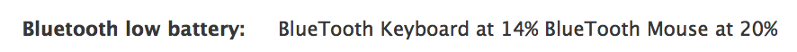
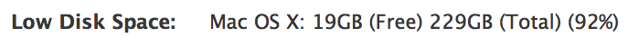
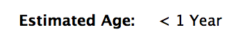

# SCL JAMF Pro Extension Attribute collection

This repository contains a collection of scripts written to perform as extension attributes for the JAMF Pro of management tool. They have been written to suit our specific environment and may need to be modified to operate correctly in others. 

## Contents

* [Download](#download) - get the .dmg
* [Contact](#contact)
* [System Requirements](#system-requirements)
* [Install](#install)
* [Uninstall](#uninstall)
* [Purpose](#purpose)
* [The Scripts](#scripts)
  * [Bluetooth device battery level](#bluetooth-device-battery-level)
  * [Disk free space reporter](#disk-free-space-reporter)
  * [Estimated date of manufacture](#estimated-date-of-manufacture)
  * [Estimated Age](#estimated-age)
  * [SMARTmon check](#smartmon-check)
  * [Time Machine Status](#time-machine-status)
  * [Attached Displays](#attached-displays)
  * [External Encrypted Disks](#external-encrypted-disks)
* [Notes](#notes)
* [Update History](#update-history)

## Download

[Download the latest installer here!](../../releases/)

## Contact

If you have any comments, questions, or other input, either [file an issue](../../issues) or [send us an email](mailto:mlib-its-mac-github@lists.utah.edu). Thanks!

## System Requirements
These scripts are designed to be as extension attributes within Casper's JAMF Software Server (JSS). Most of them are written in Python.

* Python 2.7 (included in MacOS)

## Install

These scripts are designed to be copy-and-pasted into a script field in a JSS extension attribute field.

## Uninstall

Delete the extension attribute.

## Purpose

These scripts are meant to expand the capabilities of JAMF Pro utilizing the Extension Attribute mechanism. JAMF's EA documentation can be found [here](http://docs.jamf.com/10.0.0/jamf-pro/administrator-guide/Computer_Extension_Attributes.html). Using the information returned by an EA, you can build [smart groups](http://docs.jamf.com/10.0.0/jamf-pro/administrator-guide/Smart_Computer_Groups.html). Being a member of a specific smart group can cause additional actions to take place. For example, if the Bluetooth battery level is low, an email could be sent to the user remining them to change the batteries.

Please feel free to use the code provided to build your own scripts.

## The scripts

### Bluetooth device battery level

Detects keyboards, mice and trackpads. Reports if the battery for a device is less than 30%.

### Disk free space reporter

Returns the name, free space, total space and percentage of drive used for each disk attached to a machine.

### Estimated date of manufacture

Parses a machines serial number to estimate date of manufacture. Borrows heavily from [this script](https://github.com/pudquick/pyMacWarranty/blob/master/getwarranty.py).

### Estimated Age

Similar to the Estimated date of manufacture script, but returns a simpler value. Also borrows heavily from [this script](https://github.com/pudquick/pyMacWarranty/blob/master/getwarranty.py).

### SMARTmon check

This EA was written to check all of the disks attached to the local machine. It returns a string containing a single character for each disk. The following table describes the characters and their meanings:

| Symbol  | Meaning                                  |
| ------- | ---------------------------------------- |
| .       | No errors detected on that disk.         |
| Numeral | An error was detected on that disk.      |
| ?       | SMARTmon suffered an error while checking that disk. |

Example reports:

| Sample reports |                                          |
| -------------- | ---------------------------------------- |
| .              | A single disk was checked and no errors were detected. |
| 0...           | Four disks were checked and disk0 is returning SMART errors. |
| ..?            | Three disks were available and disk2 had a SMARTmon error. |

Note: This EA requires that [SMARTmon tools](https://www.smartmontools.org/) is installed on each client.

### Time Machine Status

This EA checks if Time Machine itself is configured, whether a Time Machine volume is available, and the current capacity of the Time Machine volume.

| Possible returns                 | Meaning                                  |
| -------------------------------- | ---------------------------------------- |
| Good 10/31 Good 24% free of 713G | Time Machine is configured and working as of 10/31 and the drive has 24% of 713 GB available. |
| Last Backup: 11/02 Not SCL drive | Time Machine is configured and working, but the drive being used is not standard. |
| Not configured, no drive         | Time Machine is not configured and no standard drive is attached. |
| Not configured, drive available  | Time Machine is not configured and there is a standard drive attached. |

### Attached Displays

This EA returns the number and information about the displays attached to a machine.

Here is the data returned for each display:
* Model/Name
* Primary (if set)
* Built-in (if built into machine)
* Retina (if capable)
* Current resolution, refresh rate and maximum resolution

| Possible returns                         | Meaning                                  |
| ---------------------------------------- | ---------------------------------------- |
| 3: iMac, Primary, Built-in, Retina, 2048 x 1152 (4096 x 2304); VS248, 1920 x 1080 @ 60 Hz (1920 x 1080); ASUS VS247, 1920 x 1080 @ 60 Hz (1920 x 1080) | 3 displays attached: iMac built-in, VS248 and VS247. |
| 2: iMac, Built-in, Retina, 2560 x 1440 (5120 x 2880); ASUS VH236H, Primary, 1920 x 1080 @ 60 Hz (1920 x 1080) | 2 displays attached: iMac built-in, VH236H primary display. |
| 1: SHARP HDMI, Primary, 1920 x 1080 @ 60 Hz (1920 x 1080) | Single Sharp display.                    |

### External Encrypted Disks

This EA was written to [assist another JAMF user](https://www.jamf.com/jamf-nation/discussions/25854/inventory-report-external-hard-drive). It returns the number of attached hard drives, and the number of encrypted drives.

## Notes

## Update History

| Date       | Version | Notes            |
| ---------- | ------- | ---------------- |
| 2017.11.24 | 1.0.0   | Initial release. |
| 2019.02.19 | 1.0.1   | Addresses looping date value with new Mac systems |
